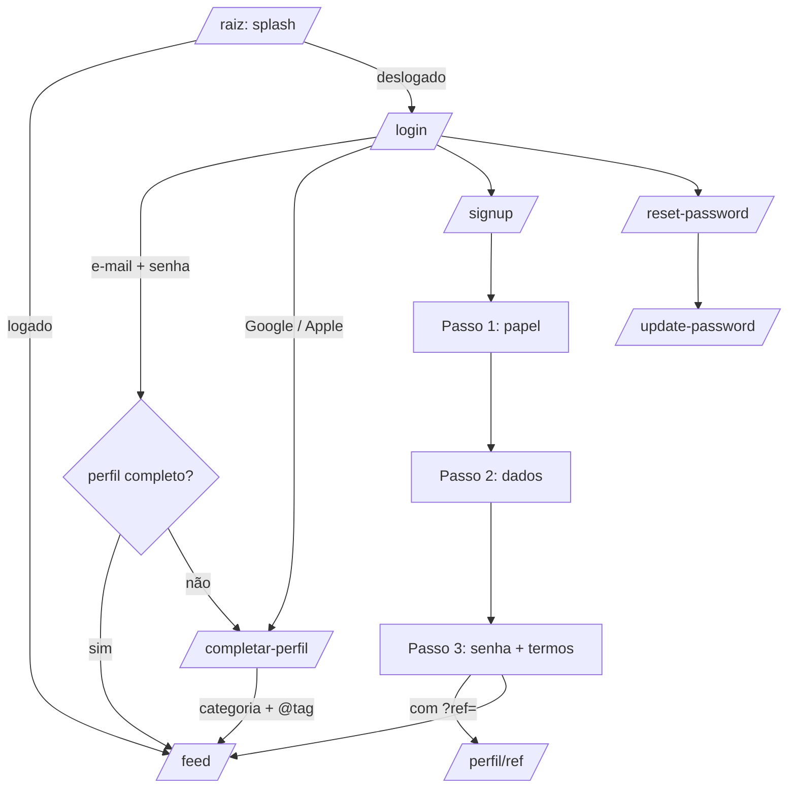
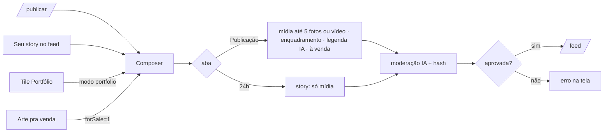
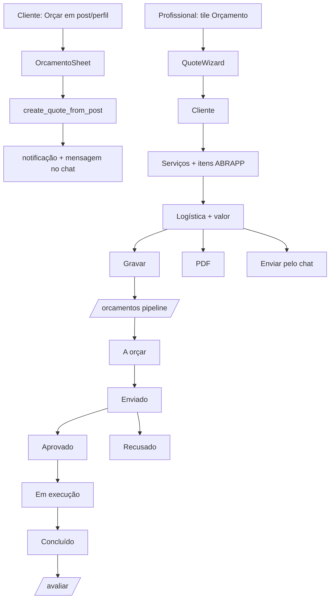
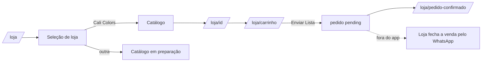

# App Flow — QueroUmaCor

> Mapa de telas e caminhos. Caminhos relativos a `next-app/`.
> Levantado do código em 2026-09-23.

## 1. Entrada e autenticação



**Guardas do `AppShell`** (`components/AppShell.tsx`):
- Deslogado em rota privada → `/login?next=<rota>` (se houver sessão salva
  no aparelho, mostra "Reconectando…" em vez do login).
- Logado com perfil incompleto (`isProfileComplete`: categoria **e** @tag) →
  `/completar-perfil`. Cada redirecionamento é registrado em
  `/admin/errors` como `profile-incomplete`.

## 2. Navegação principal

```
┌──────────────────── TopNav ────────────────────┐
│ ‹ voltar   QueroUmaCor   [GRÁTIS|PRO]  💬(n)   │
├────────────────────────────────────────────────┤
│                  conteúdo                      │
├──────────────────── BottomNav ─────────────────┤
│  Feed   Buscar   Loja   Notificações(n)  Perfil│
└────────────────────────────────────────────────┘
```

| Item | Destino |
|---|---|
| Logo | `/feed` |
| Selo de plano | `/pro` |
| 💬 | `/chat` (badge = não lidas) |
| Feed / Buscar / Loja / Notificações / Perfil | `/feed`, `/search`, `/loja`, `/notificacoes`, `/perfil` |

## 3. Mapa de rotas

### Públicas (sem login)
| Rota | Tela |
|---|---|
| `/` | Splash → redireciona |
| `/login`, `/signup`, `/reset-password`, `/update-password` | Autenticação |
| `/completar-perfil` | Onboarding pós-OAuth |
| `/delete-account` | Pedido de exclusão (exigência Google Play) |
| `/diag` | Diagnóstico do aparelho (build, SW, perfil) |
| `/info/*` | Ajuda e documentos legais |
| `/privacidade`, `/termos` (+ aliases) | Legais para as lojas |
| `/loja/pedido-confirmado/[orderId]` | Confirmação de pedido |

### Privadas
| Grupo | Rotas |
|---|---|
| Social | `/feed`, `/explore`, `/search`, `/hashtag/[tag]`, `/post/[id]`, `/publicar`, `/notificacoes` |
| Mensagens | `/chat`, `/chat/[convId]` |
| Perfil | `/perfil`, `/perfil/[id]`, `/perfil/[id]/conexoes`, `/perfil/editar`, `/perfil/publico`, `/perfil/bloqueados`, `/perfil/formacao`, `/perfil/grafites` |
| Negócio | `/orcamento-ia`, `/orcamentos`, `/orcamentos/[id]`, `/avaliar`, `/leads`, `/pedidos`, `/agenda`, `/crm`, `/financeiro`, `/notes`, `/checklist`, `/calculadora`, `/tabela-precos`, `/pontos`, `/pro` |
| Criação | `/camisetas`, `/ai-logo`, `/arte-ig`, `/click-rua` |
| Loja | `/loja`, `/loja/[id]`, `/loja/carrinho` |
| IA | `/seu-ze`, `/fe`, `/senna`, `/alice` |

**Portões:** PRO completo em Seu Zé, Fê, Senna e CRM; limites parciais em
calculadora, anotações, agenda, financeiro, orçamento e arte-ig
(`canSeeProFeature`, `lib/policies.ts`). `/alice` bloqueia profissionais.
A visibilidade por papel acontece nos tiles do perfil (seção 4).

### Admin
`/admin/errors`, `/admin/feature-interest`, `/admin/flags`,
`/admin/media-review`, `/admin/products`, `/admin/products/[id]`,
`/admin/reports`, `/admin/whatsapp` — sem AppShell; não-admin recebe 404
(`requireAdminServer()`), e a RLS (`is_portal_admin()`) protege os dados.

## 4. Perfil — grade de ferramentas (`app/perfil/BusinessGrid.tsx`)

Cada tile abre um **BottomSheet**, exceto AR Grafite (`/perfil/grafites`) e
Avaliar (`/avaliar`), que navegam. Admin vê todos.

| Tile | Papéis |
|---|---|
| AR Grafite, Arte pra venda, Click Rua | grafiteiro |
| Avaliar serviço | cliente, arquiteto |
| Pedidos, Orçamento, Orçamentos, Pontos, Portfólio, Calculadora, Agenda, CRM (PRO), Financeiro, Anotações, Camisetas, Formação | todos |
| Tabela de Preços | pintor, arquiteto |
| Seu Zé | pintor, arquiteto, sem papel |
| Alice | cliente |
| Fê | grafiteiro |
| Senna | automotivo |

Tour guiado: um na 1ª abertura do `/feed` (navegação) e outro no `/perfil`
(um passo por tile). Revisitáveis pelo rodapé do perfil.

## 5. Fluxos principais

### 5.1 Publicar


### 5.2 Orçamento


### 5.3 Loja


### 5.4 Chat
- `/chat`: abas Todas · Orçamentos · Pintor + Cali 🔗 · Cali Colors;
  arquivadas; "+ Nova"; atalho "🎨 Loja".
- `/chat/[convId]`: profissional vê o banner "Adicione a Cali Colors" →
  conversa vira 3-way; a loja responde pelo portal (Chats 3-Way).

### 5.5 Notificações → destino
| Tipo | Vai para |
|---|---|
| message | `/chat` |
| follow | `/perfil/{autor}` |
| like, comment | `/feed` |
| quote_* | `/orcamentos` |
| order | `/pedidos` |

## 6. Portal da Cali Colors (`/portal`, `public/portal/app.jsx`)

| Seção | Telas |
|---|---|
| Principal | Dashboard, Avisos, Chats 3-Way, WhatsApp, Orçamentos, Moderação |
| Pessoas | Pintores, Grafiteiros, Funileiros, Arquitetos/Engenheiros, Clientes, Usuários do Portal |
| Loja | Leads, Lojas, Pedidos da Loja, Produtos/Tintas, Camisetas, Cursos, Revista Click Rua, Marketing |
| Dados | Uso do app, Analytics, Indicações, Avaliações |

Fluxo do WhatsApp no portal: lead → **Abordar** (template) → Meta confirma
entrega → lead vira "contactado" → cliente responde → conversa na aba
WhatsApp (IA ou operador) → alerta de preço/orçamento escala para humano.
