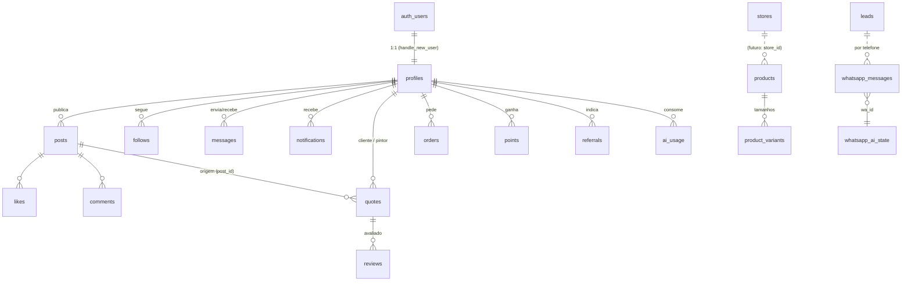

# Esquema do backend — QueroUmaCor

> Supabase (Postgres + Auth + Realtime + Storage) + rotas de API no Worker.
> Montado em 2026-09-23 aplicando o `supabase_init.sql` e **todas** as
> `/migrations/*.sql` em ordem de data.
>
> ⚠️ **Fonte da verdade é o banco vivo.** O `supabase_init.sql` e o
> `DATABASE.md` estão desatualizados (ainda descrevem `profiles` com SELECT
> público e buckets antigos). Para recriar função, usar
> `pg_get_functiondef`. Algumas tabelas e funções nasceram **fora do repo**
> (sem `CREATE` em lugar nenhum): `posts`, `leads`, `errors`,
> `certificates`, e as funções `recalc_painter_rating`,
> `award_referral_points`, `sync_profile_tag_username`,
> `redeem_pro_with_points`.

## 1. Modelo de dados (núcleo)

## 2. Tabelas

RLS está habilitada em **todas**. "Admin" = `is_portal_admin()`.
"Dono" = `auth.uid() = user_id`.

### Identidade e social
| Tabela | Para quê | Colunas-chave | Leitura / escrita |
|---|---|---|---|
| `profiles` | Perfil (espelho de `auth.users`) | `role`/`user_type` (CHECK inclui arquiteto), `tag`/`username` (sincronizados), `is_pro`, `pro_expires_at`, `pro_grace_until`, `portal_access`, `verified`, `phone`, `city`, `state`, `birth_date` (CHECK ≥18), contadores, `search_vector` | Dono ou admin lê a linha inteira; demais leem pela view `profiles_public`. Colunas sensíveis protegidas por trigger |
| `posts` | Feed, stories, portfólio, arte à venda | `status`, `deleted_at`, `media_url`, `media_urls[]`, `media_hash`, `media_width/height`, `boosted_until`, `for_sale`, `price`, `link_url` | Lê ativos aprovados (+ dono/admin). INSERT: dono com e-mail confirmado. UPDATE/DELETE: dono ou admin |
| `likes`, `follows` | Curtida, seguir | pares UNIQUE | Autenticado lê; dono escreve se não houver bloqueio |
| `comments` | Comentários | `deleted_at` | Ativos; INSERT dono + e-mail + sem bloqueio; DELETE autor, dono do post ou admin |
| `saved_posts` | Salvos | | Só dono |
| `blocks` | Bloqueios | CHECK sem auto-bloqueio | Só quem bloqueou |
| `reports` | Denúncias | `status` | Autor insere/lê; admin gerencia; 10/min |
| `notifications` | Sininho | `actor_id`, `type`, `read` | Dono lê/atualiza; criadas só por trigger/RPC. Realtime |
| `messages` | Chat 1:1 e 3-way | `conversation_id` texto, `type`, `read_at`, `deleted_at` | Participantes (inclusive por UUID contido no `conversation_id`) ou admin. INSERT remetente + e-mail + sem bloqueio. Realtime |
| `auto_responses` | Respostas automáticas | UNIQUE(user_id, trigger_type) | Dono |
| `push_subscriptions`, `push_device_tokens` | Web push / FCM-APNs | endpoint/token UNIQUE | Dono; máx. 20 por usuário |

### Negócio do profissional
| Tabela | Para quê | Observação |
|---|---|---|
| `quotes` | Orçamentos | `client_id`, `painter_id`, `post_id`, `status`, `quote_data` jsonb (serviços, itens, desconto, laudo, pagamento…). Partes ou admin. Cliente ≠ pintor. Realtime |
| `reviews` | Avaliações 1–5 | UNIQUE(quote_id, reviewer_id); INSERT só via `submit_review` |
| `jobs`, `follow_ups` | Agenda, follow-ups de orçamento | Dono |
| `notes`, `checklists` | Anotações e checklists | Dono; soft delete |
| `qualifications`, `courses`, `certificates` | Formação | Leitura pública; dono escreve |
| `art_references` | Biblioteca do AR Grafite | Dono; hash contra blocklist |
| `brand_logos` | Histórico de logos | Dono; admin lê (camisetas) |
| `price_table_items` | Tabela ABRAPP 2026 (328 itens) | Leitura pública; admin escreve |
| `click_rua_editions` | Revista Click Rua | Leitura pública; admin escreve |

### Loja e monetização
| Tabela | Para quê | Observação |
|---|---|---|
| `stores` | Lojas parceiras | `id` = slug (`calicolors`) |
| `products`, `product_variants` | Catálogo (~21 mil) e tamanhos | Leitura pública; admin escreve |
| `orders` | Pedidos | Dono cria (total recalculado por trigger); admin gerencia |
| `points` | Pontos | UNIQUE(source, reference_id) contra crédito duplo |
| `referrals` | Indicações | |
| `invoices` | Cobranças (MP/IAP) | Só via `upsert_invoice` (service role) |
| `plan_limits` | Cota de IA por plano | free 30 · pro 500 · admin 99999 |
| `ai_usage` | Consumo de IA | Escrita só por RPC de reserva |
| `commissions` | Comissões | Admin |

### Portal / WhatsApp
| Tabela | Para quê |
|---|---|
| `leads` | CRM de prospecção (60 mil+): `status`, `city`, `state`, `instagram`, `opted_out_at`, `abordagem_*` — **só admin** |
| `whatsapp_messages` | Histórico do WhatsApp: `direction`, `wa_id`, `message_id` UNIQUE, `origin` (portal/ia/celular), `media_url`, `transcript`, `delivery_status/error`. Admin lê; service role escreve. Realtime |
| `whatsapp_ai_state` | Por conversa: IA ligada (NULL = padrão global), opt-out, contador diário, última leitura, follow-up |
| `whatsapp_ai_config` | Linha única: horário, padrão, ausência, follow-up, prompt |
| `portal_alerts` | Alertas para humano (preço, orçamento) |
| `portal_chat_reads` | Leitura dos chats 3-way pelo portal |
| `announcements` | Avisos (view `announcements_public` esconde autor) |
| `feature_flags`, `feature_interest`, `invite_codes` | Rollout, interesse em features, convites |

### Segurança, conformidade e operação
| Tabela | Para quê |
|---|---|
| `consent_log` | Trilha de consentimento LGPD (`ON DELETE SET NULL`) |
| `account_deletion_requests`, `deletion_tombstones` | Exclusão de conta; ledger append-only |
| `audit_log`, `audit_events` | Ações admin; eventos de segurança/billing |
| `media_hash_blocklist`, `media_review_queue` | Blocklist CSAM; fila de moderação |
| `rate_limits` | Contadores (`user_id` text) — acesso só via RPC |
| `app_settings` | Chave/valor de sistema (URLs e segredos internos) — sem policy |
| `errors` | Log de erro do cliente (90 dias) |

## 3. Views
- **`profiles_public`** — sem `security_invoker` **de propósito** (projeta o
  subconjunto seguro de qualquer perfil com a tabela base fechada). Não
  expõe e-mail, telefone, localização, data de nascimento nem
  `portal_access`; `role='admin'` vira NULL.
- **`announcements_public`**.

## 4. Funções (RPC)

| Grupo | Funções |
|---|---|
| Feed e busca | `get_feed_v2` (usa `auth.uid()`, ignora o id do cliente, teto 50, 3 destaques no topo), `get_trending_posts`, `search_all` (teto 100), `suggest_to_follow`, `list_blocked_ids` |
| Chat | `get_conversations`, `mark_conversation_read`, `unread_message_count` |
| Orçamento | `create_quote_from_post`, `create_painter_draft`, `quote_painter_contact`, `submit_review`, `get_painter_reviews` |
| PRO e cota | `is_pro_active`, `redeem_pro_with_points`, `boost_post`/`unboost_post`, `reserve_ai_usage`, `reserve_moderation_usage`, `ai_usage_this_month`, `upsert_invoice` |
| Acesso | `is_portal_admin`, `is_email_verified`, `blocked_between`, `invite_code_valid`, `is_feature_enabled`, `notify_user` |
| WhatsApp | `whatsapp_conversas`, `whatsapp_nao_lidas`, `leads_por_telefone`, `bump_wa_ai_reply_count`, `claim_wa_followup_nudge`, `run_whatsapp_followup` |
| Admin / DR | `admin_delete_user`, `dr_integrity_report`, `request_account_deletion`, `audit_log_manual`, `execute_cleanup_orphan_media` |
| Infra | `check_rate_limit` (janela deslizante), `upsert_push_device_token`, `cleanup_*` |

## 5. Triggers

| Tabela | Trigger | Efeito |
|---|---|---|
| `auth.users` | `handle_new_user` | Cria o perfil; normaliza sinônimos de papel. **Engole a própria exceção** (falha = conta sem perfil) |
| `profiles` | `protect_profile_columns` | Reverte e audita tentativa de se promover (PRO, admin, verificado) |
| | `sync_role_from_user_type`, `audit_profile_changes`, hash de avatar, redação de notificações ao excluir | |
| `posts` | venda só para profissional, blocklist de hash, `posts_count` | |
| `follows`, `likes`, `comments` | contadores e notificações | |
| `messages` | rate limit (30/min por par, 60/min global) + bloqueio, proteção de colunas, notificação, resposta automática (1 a cada 12h) | |
| `notifications` | `dispatch_push_on_notification` | `pg_net` → `/api/push-notify`; 20/min por destinatário; texto redigido |
| `quotes` | preenche cliente, protege posse, pontos (+5 pedido, +15 concluído) | |
| `orders` | recalcula total, pontos, auditoria | |
| `invoices` | pago → PRO +30 dias | |
| `push_*` | teto de 20 por usuário | |

## 6. Storage

| Bucket | Público | Regra |
|---|---|---|
| `posts` | sim, 50 MB, imagem + vídeo | Escrita só em `<uid>/…` |
| `avatars` | sim, 4 MB | Idem |
| `art-refs` | sim | Idem |
| `exports` | sim, 10 MB, só PDF | Idem (links de PDF de orçamento) |
| `whatsapp-media` | **privado**, 15 MB | Admin lê (URL assinada); service role escreve |
| `click-rua` | sim, 15 MB | Admin escreve |
| `style-refs` | sim | Só a rota `/api/upload-style-ref` escreve |

## 7. Agendamentos (pg_cron, UTC)

| Job | Quando |
|---|---|
| `cleanup-audit-log` | diário 03:00 |
| `cleanup-soft-deleted` (30 dias) | diário 03:30 |
| `scan-orphan-media` (só lista) | domingo 04:00 |
| `whatsapp-followup-hourly` | a cada hora, :10 |
| `cleanup-rate-limits` | a cada hora |
| `cleanup-(old-)notifications`, `cleanup-(old-)audit-events` | domingo — **duplicados** (dois nomes para a mesma função) |
| `cleanup-old-errors` | domingo 05:00 |

## 8. Rotas de API (`next-app/app/api`)

Legenda: **PRO-IA** = login + PRO + rate limit + cota mensal;
**Admin** = token + (`ADMIN_EMAILS` ou `portal_access`/`role='admin'`).

| Rota | Função | Acesso |
|---|---|---|
| `chat-ai`, `fe`, `senna` | Personas | PRO-IA |
| `alice`, `alice/tts` | Alice | Login + cota |
| `caption`, `transcribe`, `tts`, `generate-logo`, `ig-art`, `area-from-photo`, `pricing-suggest`, `fin-analysis`, `receipt-ocr`, `crm-draft`, `agenda-order`, `resolve-color` | Ferramentas de IA | PRO-IA |
| `moderate`, `moderate-video`, `chat/moderate-message` | Moderação (imagem, vídeo, mensagem) | Login |
| `quote-pdf-upload` | PDF de orçamento no bucket `exports` | Login |
| `me-export`, `delete-account` | LGPD | Login estrito |
| `checkout`, `mp-webhook` | Mercado Pago (sem tela) | Token / HMAC |
| `apple-iap-verify`, `play-billing-verify` | **Stubs** — 503 sem flag de produção | Login estrito |
| `push-notify` | Envio de push | Segredo interno |
| `whatsapp/webhook` | Recebe mensagens e status | Segredo na URL (GET: verify token) |
| `whatsapp/send`, `templates`, `ai-prompt` | Envio e config do WhatsApp | Admin |
| `whatsapp/followup` (+ alias `whatsapp-evo/followup`) | Varredura de follow-up | Token do cron ou admin |
| `whatsapp-evo/suggest` | Sugestão de resposta (copiloto) | Admin |
| `admin/users`, `admin/stats`, `admin/errors-list`, `admin/moderate`, `upload-style-ref`, `ig-art-diag` | Administração | Admin |
| `auth/set-session-cookie`, `auth-rate-check` | Cookie de sessão para `/admin`; rate limit de login | Token / público |
| `cidades`, `reverse-geocode`, `log-error`, `health` | Utilidades | Público com rate limit |

## 9. Divergências a conferir no banco

1. Policies antigas `"… viewable by everyone"` (`USING true`, inclusive
   anon) em `follows`, `likes`, `qualifications` e `courses` nunca são
   derrubadas no repo — podem coexistir com as restritas.
2. Jobs de cron duplicados (seção 7).
3. Custo de `redeem_pro_with_points`: a tela diz 1000 pontos; a função só
   existe no banco — conferir com `pg_get_functiondef`.
