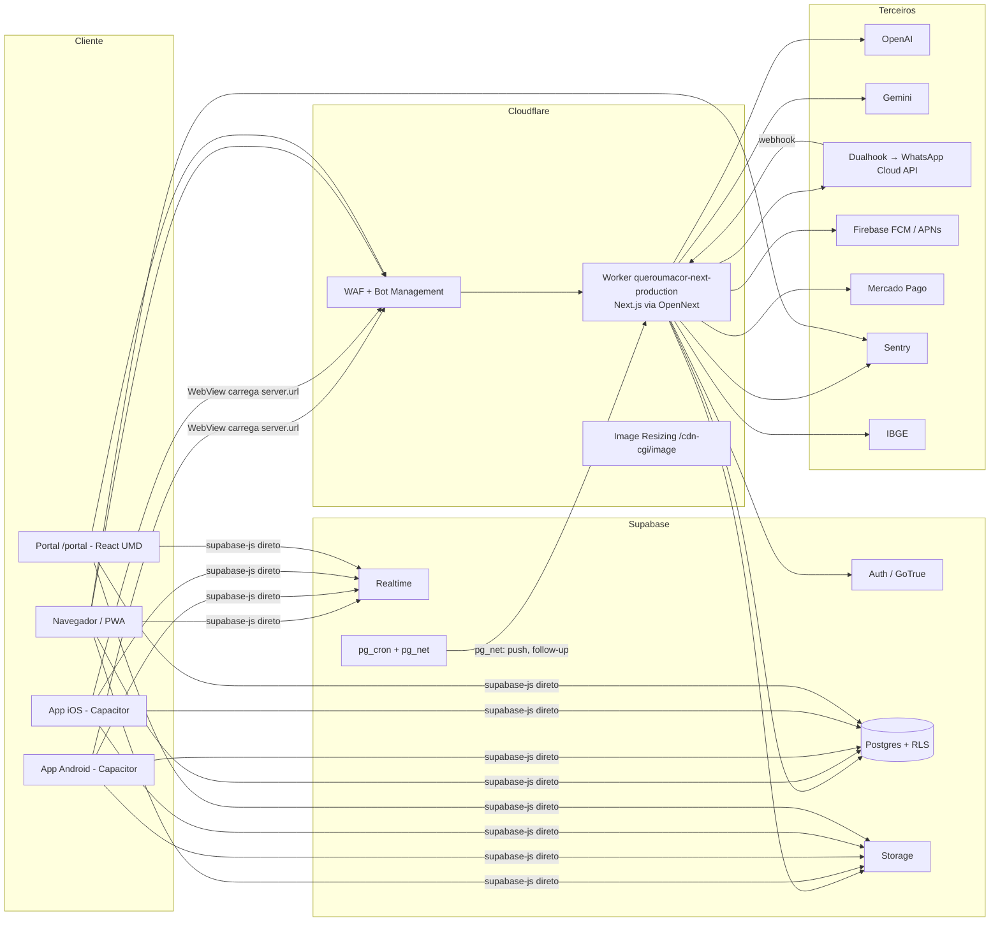

# TRD — QueroUmaCor

> Technical Requirements Document: como o produto é construído e quais
> requisitos técnicos ele precisa manter. Complementa `ARCHITECTURE.md`,
> `DEPLOYMENT.md` e os ADRs em `docs/adr/`. Levantado em 2026-09-23.

## 1. Visão da arquitetura

**Princípio:** o cliente fala **direto** com o Supabase (leitura/escrita
protegida por RLS). O Worker só entra onde precisa de segredo, IA,
integração externa ou service role.

## 2. Stack

| Camada | Tecnologia |
|---|---|
| Framework | Next.js **16.3.5** (App Router), React 19, TypeScript 5.6 |
| Estado de servidor | TanStack Query 5 |
| Formulários / validação | react-hook-form 7 + zod 3 |
| Estilo | Tailwind CSS 4 (`@theme` em `globals.css`) |
| Runtime | Cloudflare Workers via `@opennextjs/cloudflare` 1.20 (`nodejs_compat`) |
| Banco / auth / storage | Supabase (Postgres, GoTrue, Realtime, Storage) — plano PRO |
| Mobile | Capacitor 8 (Android + iOS), casca que carrega o site ao vivo |
| Builds mobile | Codemagic (`android-aab` → Play Internal; `ios-ipa` → TestFlight) |
| Observabilidade | Sentry 10 (traces 100%, replay com máscara), tabela `errors` + `/admin/errors` |
| PDF | jsPDF 4 |
| 3D / visão | three.js (AR), MediaPipe tasks-vision |
| Testes | Vitest 2 + Testing Library + jsdom |
| Portal | React UMD sem bundler; `app.jsx` → `app.js` compilado por Babel, com SRI |

## 3. Organização do código (`next-app/`)

| Pasta | Conteúdo |
|---|---|
| `app/` | Páginas (App Router) e `app/api/*` (~40 rotas) |
| `components/` | UI compartilhada e ponte nativa |
| `lib/services/` | Acesso a dados por domínio (supabase-js), usado no cliente |
| `lib/hooks/` | Hooks TanStack Query / React |
| `lib/api/` | Infra do servidor: `security.ts` (auth, PRO, rate limit, cota), `env.ts`, `_ai.ts`, `ssrf-guard.ts` |
| `lib/api/_services/` | Lógica de negócio das rotas (IA, WhatsApp, MP, FCM, moderação, admin) |
| `lib/native/` | **Única** fronteira com a casca Capacitor (via `window.Capacitor`) |
| `lib/schemas.ts`, `lib/roles.ts`, `lib/policies.ts` | Validação, papéis e regras de acesso — fontes únicas |
| `public/portal/` | Portal da loja |
| `public/sw.js` | Service worker (cache seguro + recuperação de erro) |

## 4. Integrações

| Serviço | Uso | Onde |
|---|---|---|
| OpenAI `gpt-4o-mini` | Personas, IA do WhatsApp, legenda, preço, financeiro, OCR | `lib/api/_ai.ts` |
| OpenAI `gpt-image-1` | Logos, arte para Instagram | `generate-logo`, `ig-art` |
| OpenAI `whisper-1` / `tts-1` | Transcrição (áudio, WhatsApp) / voz | `transcribe`, `tts` |
| Gemini `2.5-flash` | Fallback de texto; moderação de imagem e vídeo | `moderate*.ts` |
| Dualhook (Cloud API) | Envio e webhook do WhatsApp oficial | `lib/api/_services/whatsapp*.ts` |
| FCM HTTP v1 / VAPID | Push nativo / web push | `fcm.ts`, `/api/push-notify` |
| Mercado Pago | Assinatura PRO — **sem tela** hoje | `/api/checkout`, `/api/mp-webhook` |
| IBGE | Estados e cidades | `/api/cidades` |

## 5. Requisitos técnicos (obrigatórios)

### 5.1 Segurança
- **RT-S1** RLS habilitada em **toda** tabela `public`; função em policy
  sempre embrulhada em `(select …)`.
- **RT-S2** Função `SECURITY DEFINER` sempre com `SET search_path`.
- **RT-S3** Rotas de IA: autenticação obrigatória (401 sem token), cota
  mensal (`reserve_ai_usage`) e rate limit; corpo limitado
  (`rejectOversizedBody`).
- **RT-S4** Webhooks autenticados (segredo na URL, HMAC ou envelope) e
  idempotentes (`message_id` UNIQUE); após autenticar, responder 200.
- **RT-S5** Headers de segurança (CSP, HSTS, COOP/CORP, Permissions-Policy)
  e CORS de `/api/*` vêm do `middleware.ts` — **não** do `next.config`.
- **RT-S6** Requisições com header `Next-Action` são barradas (não há Server
  Actions).
- **RT-S7** Source maps removidos do artefato (`strip-source-maps.mjs`).
- **RT-S8** SSRF: `global_fetch_strictly_public` + `ssrf-guard.ts`;
  push só para hosts de provedores conhecidos.
- **RT-S9** Segredos só em env do Worker, lidos por `getRuntimeEnv()` —
  nunca `process.env` cru, nunca no module-load (teste de arquitetura).
- **RT-S10** URL e anon key do Supabase sempre do mesmo par
  (`resolveSupabaseEnv()`).

### 5.2 Confiabilidade
- **RT-C1** Rota de edge tem **orçamento total** de tempo, não só timeout
  por chamada.
- **RT-C2** Todo `await` de rede no boot tem teto (promessa pendurada em
  WebView não rejeita).
- **RT-C3** Trabalho depois da resposta via `runAfterResponse`
  (`ctx.waitUntil` do OpenNext).
- **RT-C4** Service worker nunca grava nem devolve resposta de erro do
  cache; 5xx vira página de retry.
- **RT-C5** Falha de envio externo nunca responde 502/504 (o Cloudflare
  substitui o corpo).
- **RT-C6** Recurso novo tolera SQL ainda não rodado (42703/42P01/42883 →
  caminho antigo).

### 5.3 Desempenho
- Feed em 1 RPC (`get_feed_v2`); índices parciais por `deleted_at`/status.
- Imagens por Image Resizing (WebP/AVIF, `srcset`), `width/height` gravados
  para CLS zero.
- Upload de foto comprimido acima de 2 MB.
- Listas grandes paginadas em paralelo e renderizadas em janela.

### 5.4 Privacidade (LGPD)
- `consent_log` por tipo/versão; exportação (`/api/me-export`) e exclusão
  de conta; `deletion_tombstones`.
- Sentry com PII mascarada (mensagem, breadcrumbs, URL, headers).
- Push sem conteúdo de mensagem/comentário.

### 5.5 Mobile
- Identidades: Android `br.com.queroumacor`, iOS `br.com.queroumacor.app`
  (não unificar). Deep link OAuth `br.com.queroumacor.app://auth/callback`
  com PKCE.
- Dentro da casca, navegação de documento é proibida em tela
  (`router.push`), link externo por `abrirLinkExterno`.
- Permissão da WebView vem em par (ex.: `RECORD_AUDIO` +
  `MODIFY_AUDIO_SETTINGS`).
- R8 desligado (quebrou o boot); nunca publicar mudança de casca sem abrir
  o AAB antes.

## 6. Ambientes e deploy

| Ambiente | Como |
|---|---|
| Produção | Worker `queroumacor-next-production`, domínios `queroumacor.com.br` e `www`; deploy **manual** por `deploy.yml` (`workflow_dispatch`, só `main`) |
| Preview | Worker `-preview` |
| Mobile | Codemagic; casca carrega `server.url`, então mudança web não precisa de build nova |

CI: `ci.yml` (lint, typecheck, testes — check `validate` obrigatório),
`codeql.yml`, `security.yml` (audit, gitleaks, ZAP), `uptime.yml`.

**Pendência conhecida:** o passo de rotas do `wrangler deploy` falha por
permissão de zona do token (`Zone > Workers Routes > Edit`); o código sobe
mesmo assim.

## 7. Definição de pronto (técnica)

1. `npx tsc --noEmit`, `npx vitest run` (conferir a linha **Test Files**,
   não só Tests) e, para mudança estrutural, `next build`.
2. SQL novo: arquivo em `/migrations`, colado no chat, com consulta de
   conferência que **lista** o que existe.
3. Mudou o `app.jsx` do portal: recompilar, refazer SRI e `?v=`.
4. Registrar no `CLAUDE.md` na hora.
